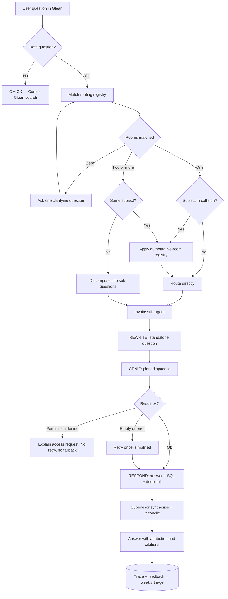

# GM Customer Experience Agent
## Final Architecture Plan — 10 Genie Rooms with Glean as Front End and Supervisor

**Program:** Customer Experience Agent (`proj-customer-experience-agent2`)
**Data platform:** Databricks — workspace `a1000781-t11-musea2-dbx-main`
**Orchestration & UX:** Glean (Assistant + Agent Builder + Databricks tool)
**Source of truth for tables:** `Customer_Experience_Agent_Project_Tracker.xlsx` → `Table_Access_Status`
**Document status:** Final plan for review · Version 1.0 · 21 Aug 2026

---

## 1. Executive summary

This plan implements the team's two locked decisions:

1. **Ten Genie rooms — one per tracker category, with no mixing of categories.**
2. **Glean is both the front end and the supervisor** — users never open Databricks; Glean routes every question to the correct Genie room, and Glean is where answers, citations and follow-ups live.

The resulting system is a three-layer architecture. **Glean** owns identity, conversation, routing and synthesis. **Genie** owns the semantic layer — one room per business domain, each trained with instructions, column comments, declared joins and trusted queries. **Unity Catalog** owns governance — every query runs as the asking user, so table-level approvals in the tracker are enforced automatically with no work in Glean.

Three findings from the analysis drive the design and are the parts of this plan that need the most attention:

- **The DWG room is the accuracy risk.** Databricks recommends starting a Genie room with **five or fewer tables** and caps a room at **30**. DWG holds 26 entries — 20 usable after removing blanks — spanning eight distinct subjects (diagnostics, repair orders, cases, surveys, VIN master, connected features, feature store, calendar). It is legal but four times the recommended size, and it is the one room most likely to produce wrong-table answers. Section 9 gives it a dedicated mitigation plan.
- **Six subjects are covered by two rooms at once.** Repair orders, roadside, OneCRM cases, SPAC, dealer surveys and NPS each exist in the DWG room *and* in their own category room, usually as different physical tables. Left alone this produces the worst failure mode in a multi-room system: the same question answered by two rooms with two different numbers. Section 6 defines an **authoritative-room registry** that resolves every collision, enforced through the Glean routing descriptions.
- **Glean's Genie action does not support multi-turn conversation.** Analytics is inherently multi-turn ("now split that by region"). The fix is a **question-rewriter step** inside every Glean sub-agent that folds conversation history into one standalone question before calling Genie. This is implementable entirely in Glean and is the single most important thing to validate in the pilot.

Everything else — the training playbook, the per-room specs, the eval loop — is mechanical once those three are settled.

---

## 2. Locked decisions and their consequences

| Decision | Consequence for this design |
|---|---|
| 10 Genie rooms, one per tracker category | Room boundaries follow the tracker, not question shape. Overlap between rooms must be resolved in the routing layer instead of by re-grouping tables. |
| No mixing of categories | A table that appears in three tracker categories is added to all three rooms. Rooms stay faithful to the tracker; the Glean descriptions do the disambiguation. |
| Glean is the front end | Users ask in Glean Assistant / Slack / Teams. Nobody is expected to open a Genie space, though a deep link is always offered for drill-down. |
| Glean is the supervisor | No Databricks-side multi-agent supervisor is built. Routing, decomposition and synthesis all happen in Glean Agent Builder. |
| Genie remains the semantic layer | All instructions, column comments, joins and trusted queries are still authored in Databricks. Glean does not replace this work — it consumes it. |

**What we consciously give up by not mixing categories:** the ability to answer a question with a SQL join across two domains. Glean can call two rooms and narrate both results, but it cannot join them. Section 10.3 identifies the cross-domain questions this affects and the remedy.

---

## 3. Complete source inventory mapped to the ten rooms

68 tracker entries. **50 are trainable today**; 18 are excluded or held.

| Disposition | Count | Detail |
|---|---|---|
| Trainable now | **50** | Of which **4 carry a test-catalog caveat** (Rooms 6 and 7) |
| Blank — diagnose with owner | 6 | 5 in DWG · 1 in LTV (the `acquire` duplicate-name copy) |
| Near-empty (3 rows) | 1 | `dwg_onecrm_messaging_detail_vw` |
| Access not yet approved | 7 | All in Exp_hub |
| Test/temp copies with prod twins | 3 | `connected_services_test…temp_ltv_*` |
| Inactive — confirm with owner | 1 | CMDS/CRM `gm_adata` |

### Room-level summary

| # | Genie room | Tracker category | Entries | Trainable now | Excluded / held | Size vs. Genie guidance |
|---|---|---|---|---|---|---|
| 1 | `GM-CX-DWG` | DWG | 26 | 20 | 5 blank, 1 near-empty (3 rows) | ⚠️ 20 tables — 4× recommended, under the 30 cap |
| 2 | `GM-CX-ExpHub` | Exp_hub | 16 | 8 | 7 access-pending, 1 inactive | ⚠️ grows to ~15 as access lands |
| 3 | `GM-CX-LTV` | LTV | 9 | 5 | 1 blank duplicate, 3 test/temp | ✅ ideal size — already built |
| 4 | `GM-CX-RepairOrders` | RepairOrders | 4 | 4 | — | ✅ ideal size |
| 5 | `GM-CX-Roadside` | RoadSideEvents | 1 | 1 | — | ✅ single table |
| 6 | `GM-CX-DealerSales` | DealerSales | 4 | 4 | — | ⚠️ 2 of 4 in a test catalog |
| 7 | `GM-CX-SPAC-SOS` | SPAC_SOS | 2 | 2 | — | ⚠️ both in a test catalog |
| 8 | `GM-CX-SurveyNPS` | Survey_NPS | 2 | 2 | — | ✅ ideal size |
| 9 | `GM-CX-Loyalty` | Loyalty_TrueBlue | 1 | 1 | — | ✅ single table |
| 10 | `GM-CX-CRM` | CRM | 3 | 3 | — | ✅ ideal size |
| | **Total** | | **68** | **50** | **18** | |

> Genie supports a maximum of **30 tables or views per room** and performs best at **five or fewer**. Rooms 1 and 2 are the only ones outside the comfort zone.

### 3.1 Room 1 — `GM-CX-DWG` (Dealer Workbench)

Base schema `aftersales_prod.gold_enterprise_experience_engine_e3_gmna` unless shown otherwise.

| # | Table | Train? | Reason |
|---|---|---|---|
| 1 | `dwg_charging_vw` | ⛔ No | Blank — diagnose with owner, add when loaded |
| 2 | `dwg_cvo` | ⛔ No | Blank |
| 3 | `dwg_dtc_vw` | ✅ Yes | Diagnostic trouble codes |
| 4 | `dwg_field_action_vw` | ✅ Yes | Field actions / recalls |
| 5 | `dwg_mobile_metrics_vw` | ✅ Yes | Mobile app metrics |
| 6 | `dwg_notifications_vw` | ✅ Yes | Vehicle / customer notifications |
| 7 | `dwg_onecrm_case_vw` | ✅ Yes | OneCRM cases (curated view) — see collision C3 |
| 8 | `dwg_onecrm_messaging_detail_vw` | ⛔ No | Only 3 rows — statistically meaningless, will mislead sampling |
| 9 | `dwg_onecrm_messaging_vw` | ⛔ No | Blank |
| 10 | `dwg_ota_detail` | ⛔ No | Blank |
| 11 | `dwg_repair_order_open_vw` | ✅ Yes | Open repair orders — see collision C1 |
| 12 | `dwg_repair_order_vw` | ✅ Yes | Repair orders — see collision C1 |
| 13 | `dwg_roadside_vw` | ✅ Yes | Roadside events — see collision C2 |
| 14 | `dwg_siebel_case_vw` | ✅ Yes | Legacy Siebel cases |
| 15 | `dwg_spac_vw` | ✅ Yes | SPAC cases (**prod**) — see collision C4 |
| 16 | `dwg_supercruise_vw` | ✅ Yes | Super Cruise usage |
| 17 | `dwg_survey_compass_vw` | ⛔ No | Blank |
| 18 | `dwg_survey_dealer_sales_vw` | ✅ Yes | Dealer sales survey (**prod**) — see collision C5 |
| 19 | `dwg_survey_dealer_service_vw` | ✅ Yes | Dealer service survey (**prod**) — see collision C5 |
| 20 | `dwg_umf_dealer_report_dates_vw` | ✅ Yes | Dealer reporting calendar — use as a date helper |
| 21 | `dwg_vin_dashboard_vw` | ✅ Yes | VIN-level dashboard (pre-aggregated — do not re-aggregate) |
| 22 | `dwg_vin_vw` | ✅ Yes | VIN master |
| 23 | `marketing_prod.gold_customer_feature_store_gmna.customer_attributes` | ✅ Yes | Feature store |
| 24 | `marketing_prod.gold_customer_feature_store_gmna.customer_behavior` | ✅ Yes | Feature store |
| 25 | `marketing_prod.gold_customer_feature_store_gmna.owner_behavior` | ✅ Yes | Feature store |
| 26 | `marketing_prod.gold_customer_feature_store_gmna.vehicle_attributes` | ✅ Yes | Feature store — also in Room 2 (collision C6) |

**Internal subjects (8):** diagnostics & recalls · connected features · digital engagement · repair orders · roadside · cases (OneCRM, Siebel, SPAC) · surveys · VIN master & feature store. This breadth is why Room 1 needs the treatment in Section 9.

### 3.2 Room 2 — `GM-CX-ExpHub` (Experience Hub / Customer & Vehicle 360)

| # | Table | Train? | Reason |
|---|---|---|---|
| 27 | `...e3_gmna.e3_vin_detail` | ✅ Yes | Vehicle 360 |
| 28 | `...e3_gmna.e3_indiv_detail` | ✅ Yes | Individual / customer detail |
| 29 | `marketing_prod...vehicle_attributes` | ✅ Yes | Also in Room 1 (collision C6) |
| 30 | `...silver_...e3_gmna.survey_hub_inmoment_global_vw` | ✅ Yes | Also Rooms 6 & 8 (collision C7) |
| 31 | `...silver_...e3_gmna.survey_hub_inmoment_us_vw` | ✅ Yes | Also Rooms 6 & 8 (collision C7) |
| 32 | `customer_prod...acxiom_survived_individual_demographic` | ⏳ Pending | Access not approved |
| 33 | `customer_prod.silver_individual_gmna.consolidated_customer` | ⏳ Pending | Access not approved |
| 34 | `sales_prod.gold_vehicle_ownership_gmna.vehicle_ownership` | ✅ Yes | Customer ↔ VIN bridge — the most important join in this room |
| 35 | `connected_services_prod...enrlmnt_reqst` | ⏳ Pending | Access not approved |
| 36 | `onstar_...gmna.member_base_history` | ✅ Yes | OnStar member base — subject overlap with Room 3 (collision C8) |
| 37 | `mktg_dmp_silver_prod...cust_engage_actv_detail` | ⏳ Pending | Access not approved |
| 38 | `marketing_prod...omdb_accy_ecom_omdb_txn` | ⏳ Pending | Access not approved |
| 39 | `dataproducts.silver_customer_experience_e3` (gold NPS) | ⏳ Pending | Access not approved — belongs with Room 8 on arrival if the tracker moves it |
| 40 | `marketing_prod...loyalty_myr_member_ecomm_purchases` | ⏳ Pending | Access not approved — subject overlap with Room 9 |
| 41 | `quality_prod.gold_vehicle_warranty_claims_gbl` (coverage/expiration) | ✅ Yes | Confirm exact table list — the entry names a family, not one table |
| 42 | `gmdataassets.dl_edge_base_everest_14608_base_crmanltp_gm_adata` | ⚠️ Hold | Marked inactive — confirm with owner before adding |

### 3.3 Room 3 — `GM-CX-LTV` (already built)

| # | Table | Train? | Reason |
|---|---|---|---|
| 43 | `onstar_...gmna.ltv_connected_plan_cohort` | ✅ Yes | Core VIN × period × plan fact |
| 44 | `acquire.gold_connected_vehicle.ltv_connected_plan_cohort` | ⛔ No | Blank **and** a duplicate display name — worst case for Genie table selection |
| 45 | `connected_services_prod...ltv_fan_salesforce_account_dim` | ✅ Yes | FAN fleet dimension |
| 46 | `connected_services_prod...ltv_modeling_12m` | ✅ Yes | 12-month LTV modeling |
| 47 | `connected_services_prod...ltv_featrs_by_fan` | ✅ Yes | LTV features by FAN |
| 48 | `connected_services_prod...ltv_modeling_12m_scored` | ✅ Yes | Scored model output |
| 49–51 | `connected_services_test...temp_ltv_*` (3 tables) | ⛔ No | Test/temp copies — prod twins exist for all three |

Existing project docs (*Genie Room Setup Guide — OnStar*, *Genie Training — OnStar Room*) already carry this room's instructions, column-comment DDL, FAN join verification and eight trusted queries. Extend with tables 46–48 using the same playbook.

### 3.4 Rooms 4–10

| Room | # | Table | Train? | Note |
|---|---|---|---|---|
| **4 · RepairOrders** | 52 | `...e3_ro_summary` | ✅ | RO header — grain: repair order |
| | 53 | `...e3_ro_part_detail` | ✅ | Parts on RO |
| | 54 | `...e3_ro_labor_detail` | ✅ | Labor ops on RO |
| | 55 | `...e3_ro_detail` | ✅ | RO line detail |
| **5 · Roadside** | 56 | `...e3_rscu_detail` | ✅ | Single-table room |
| **6 · DealerSales** | 57 | `...silver...survey_hub_inmoment_global_vw` | ✅ | Shared (C7) |
| | 58 | `...silver...survey_hub_inmoment_us_vw` | ✅ | Shared (C7) |
| | 59 | `aftersales_test...dwg_survey_dealer_service_vw` | ⚠️ Yes, caveated | **Test catalog** — prod twin is Room 1 #19 (C5) |
| | 60 | `aftersales_test...dwg_survey_dealer_sales_vw` | ⚠️ Yes, caveated | **Test catalog** — prod twin is Room 1 #18 (C5) |
| **7 · SPAC_SOS** | 61 | `aftersales_test...dwg_spac_vw` | ⚠️ Yes, caveated | **Test catalog** — prod twin is Room 1 #15 (C4) |
| | 62 | `aftersales_test...e3_spac_open_cases_vw` | ⚠️ Yes, caveated | **Test catalog**, no prod twin known |
| **8 · Survey_NPS** | 63 | `...silver...survey_hub_inmoment_us_vw` | ✅ | Shared (C7) — **authoritative for NPS** |
| | 64 | `...silver...survey_hub_inmoment_global_vw` | ✅ | Shared (C7) |
| **9 · Loyalty** | 65 | `mktg_dmp_prod...model_serviceloyaltytiers_360_tb` | ✅ | Single-table room |
| **10 · CRM** | 66 | `...onecrm_a219315_case_activity_task_details` | ✅ | Case activities/tasks |
| | 67 | `...onecrm_a219315_emp_hierarchy` | ✅ | Agent/employee hierarchy |
| | 68 | `...onecrm_a219315_case_details` | ✅ | **Authoritative case master** (C3) |

---

## 4. Per-room build specification

Each room needs the same six artefacts. This table is the build contract — a room is not "done" until every cell is filled.

| Room | Grain | Primary keys / joins | Core metrics to define | Hard guardrails |
|---|---|---|---|---|
| 1 · DWG | Mixed — VIN, RO, case, survey response | `vin` everywhere; `ro_number`; `case_id` | Counts by subject; DTC frequency; open-RO ageing; Super Cruise engagement | `dwg_vin_dashboard_vw` is pre-aggregated — never re-aggregate. Never answer NPS from this room (route to 8). Never answer RO line detail (route to 4). |
| 2 · ExpHub | Customer, VIN, ownership span | `vin`; individual/customer id; `vehicle_ownership` as the bridge | Customer counts, ownership tenure, warranty coverage status | Never answer survey/NPS questions even though the InMoment views are present — redirect to Room 8. Dimension room: no revenue metrics. |
| 3 · LTV | VIN × accounting period × plan | `vin`, `account_number`/`biz_assoc_id` → `fan_clean` | Revenue, ARPU/ARPS, churn rate, attach rate, LTV score | Rates as `SUM(num)/NULLIF(SUM(den),0)`. Confirm FAN join key before enabling cross-table examples. FAN dim joins fleet rows only. |
| 4 · RepairOrders | Repair order → line → part/labor | `ro_number` header→detail; `vin` | RO volume, labor hours, parts cost, average RO value | Summary vs. detail double-count: never sum detail and summary together. Authoritative for all RO analytics. |
| 5 · Roadside | Roadside event | `vin`; event id | Event volume, event type mix, time-to-service | Single table — no joins available. For roadside + RO together, escalate (Section 10.3). |
| 6 · DealerSales | Survey response | dealer code; `vin` | Dealer sales/service survey scores, response rates | Test-catalog source — every answer carries a "figures indicative, sourced from test catalog" caveat until prod twins land. |
| 7 · SPAC_SOS | SPAC case | `case_id`; `vin` | Open case counts, ageing, resolution rate | Same test-catalog caveat. Where DWG's prod `dwg_spac_vw` disagrees, prod wins — see C4. |
| 8 · Survey_NPS | Survey response | response id; `vin`; dealer code | **NPS = (%promoters − %detractors)** — define explicitly | Authoritative for NPS. Choose US vs. global scope explicitly; never blend the two views without stating which. |
| 9 · Loyalty | Customer × loyalty tier | customer id; `vin` | Tier distribution, tier migration | Single table. Tier is a snapshot — state as-of date. |
| 10 · CRM | Case → activity | `case_id`; employee id → hierarchy | Case volume, handle time, activity counts, agent performance | Authoritative for case analytics. Agent-level metrics are people data — apply the same care as any HR-adjacent reporting. |

### 4.1 Standard training playbook (applies to all ten rooms)

1. **Curate.** Add only tables with data. Never add a blank table — Genie samples rows to learn value distributions, so an empty source yields no learning yet can still be selected, returning confident empty answers. Prefer prod over `_test`/`temp_`. Log every exclusion.
2. **Column comments in Unity Catalog.** `ALTER TABLE … ALTER COLUMN … COMMENT` for every column the room will use: meaning, units, enumerated values, key status. Databricks is explicit that well-documented columns are the single biggest accuracy lever.
3. **Room instructions — four blocks.** (a) scope and table-selection guidance; (b) synonym map; (c) metric definitions as SQL expressions; (d) guardrails. Databricks guidance is to **prefer SQL expressions and example queries over prose**, and to keep text instructions short — long instruction blocks degrade accuracy in extended conversations.
4. **Declare joins explicitly**, with direction and applicable filters. Verify ambiguous keys with an overlap-count query before trusting them.
5. **Trusted example queries** — 8–12 per room covering the highest-value questions, each encoding the preferred logic. These are the strongest signal Genie has.
6. **Validate** against the room's golden question set (Section 12).

---

## 5. Glean layer design

### 5.1 Components

| Component | Count | Purpose |
|---|---|---|
| **Supervisor agent** — `GM Customer Experience Agent` | 1 | The front door. Classifies intent, rewrites follow-ups, routes to sub-agents, synthesises, responds with citations. |
| **Domain sub-agents** — `GM CX — <Category>` | 10 | One per Genie room. Thin wrappers: rewrite → Genie call (pinned Space ID) → format → respond. |
| **Knowledge sub-agent** — `GM CX — Context` | 1 | Glean search over Confluence, SharePoint, Slack, tickets. Supplies definitions, owners, known issues alongside numbers. This is the reason to front the system with Glean rather than Databricks. |
| **Databricks tool** (admin-configured) | 1 | Provides the *Search Databricks with Genie* and *Search Databricks with SQL* actions. User OAuth; a default Genie Space ID at tool level, overridden per step. |

Glean agents are built from **triggers, steps, tools and flow logic**, and a parent agent can **call sub-agents**, which keep their own memory — only the output of a sub-agent's *respond* step returns to the parent. That property is exactly what we want: the SQL, row payloads and retry noise stay inside the sub-agent, and only the clean answer reaches the supervisor's context.

### 5.2 Sub-agent internal design (identical for all ten)

```
GM CX — <Category>
 ├─ Step 1  REWRITE   think step: fold conversation history into ONE standalone question
 │                    (mandatory — Glean's Genie flow is single-turn only)
 ├─ Step 2  GENIE     tool: Search Databricks with Genie
 │                    genie_space_id = <pinned space for this room>
 │                    query          = [[step1.output]]
 ├─ Step 3  CHECK     flow logic: empty / error / permission-denied → Step 3a fallback
 │                    otherwise → Step 4
 │   └─ 3a  RETRY     one re-ask with a simplified question, then fall through
 └─ Step 4  RESPOND   format: answer + generated SQL (collapsed) + Genie space deep link
                      + source caveat if the room is test-catalog backed
```

Only Step 4's output returns to the supervisor.

### 5.3 Supervisor design

```
GM Customer Experience Agent
 ├─ Step 1  CLASSIFY    intent → one of 10 rooms | multi-room | non-data | ambiguous
 ├─ Step 2  BRANCH
 │    ├─ non-data      → GM CX — Context (Glean search) → respond
 │    ├─ ambiguous     → ask ONE clarifying question, then re-classify
 │    ├─ single-room   → call the matching sub-agent
 │    └─ multi-room    → decompose, call 2–3 sub-agents in sequence
 ├─ Step 3  ENRICH      optional: GM CX — Context for definitions/owners/known issues
 ├─ Step 4  SYNTHESISE  merge results; if two rooms disagree, apply the authoritative
 │                      -room registry (Section 6) and say which source won and why
 └─ Step 5  RESPOND     answer + per-room attribution + SQL links + feedback control
```

### 5.4 Databricks tool configuration

| Setting | Value | Note |
|---|---|---|
| Auth | **User OAuth** | Each user authenticates with their own Databricks credentials. This is what makes UC governance work end to end. |
| Default Genie Space ID | `GM-CX-DWG` | Only a fallback; every sub-agent overrides it. |
| Per-step Space ID | Pinned per sub-agent | Set in Agent Builder on the Genie step. |
| SQL action | Enabled, restricted | *Search Databricks with SQL* is available for the data team's own agents; keep it out of the ten domain sub-agents so all business logic stays in the Genie rooms. |
| Warehouse | Dedicated CX serverless warehouse | Isolates cost and lets us attribute spend to this program. |

---

## 6. Collision analysis and the authoritative-room registry

The one-room-per-category rule means eight subjects are reachable from two rooms. Two distinct risk types:

- **Type A — same physical table in several rooms.** Both rooms return identical numbers; only attribution is inconsistent. Low severity.
- **Type B — different tables covering the same subject.** Two rooms can return *different numbers for the same question*. High severity — this is the failure mode that destroys trust in a multi-agent analytics system.

| ID | Subject | Room A | Room B | Type | **Authoritative room** | Rule enforced in Glean descriptions |
|---|---|---|---|---|---|---|
| C1 | Repair orders | 1 · DWG (`dwg_repair_order_vw`, `_open_vw`) | 4 · RepairOrders (`e3_ro_*`) | **B** | **4 — RepairOrders** for all analytics | Room 1 answers only "what does the dealer workbench show for open ROs"; anything with parts, labor, cost, trend → Room 4 |
| C2 | Roadside | 1 · DWG (`dwg_roadside_vw`) | 5 · Roadside (`e3_rscu_detail`) | **B** | **5 — Roadside** | Room 1's description omits roadside keywords entirely |
| C3 | OneCRM cases | 1 · DWG (`dwg_onecrm_case_vw`) | 10 · CRM (`onecrm_a219315_case_details`) | **B** | **10 — CRM** | Room 1 handles dealer-workbench case *views*; case analytics, activities, agents → Room 10 |
| C4 | SPAC cases | 1 · DWG (`dwg_spac_vw`, **prod**) | 7 · SPAC_SOS (same view, **test**) | **B** | **1 — DWG (prod)** for counts; **7** only for `e3_spac_open_cases_vw` | Prod beats test whenever both can answer. Revisit when prod twins land. |
| C5 | Dealer surveys | 1 · DWG (**prod** views) | 6 · DealerSales (**test** views) | **B** | **6 — DealerSales** for survey analysis, but flag the test-catalog caveat; use Room 1's prod view to sanity-check numbers | If the two disagree, escalate — do not silently pick one |
| C6 | `vehicle_attributes` | 1 · DWG | 2 · ExpHub | A | **2 — ExpHub** for customer/vehicle profile questions | Identical table; attribution only |
| C7 | InMoment surveys | 2 · ExpHub, 6 · DealerSales, 8 · Survey_NPS | — | A | **8 — Survey_NPS** for NPS/satisfaction; **6** for dealer-specific survey questions | Room 2's description must contain **no** survey/NPS keywords |
| C8 | OnStar member base | 2 · ExpHub (`member_base_history`) | 3 · LTV (subject overlap) | **B** | **3 — LTV** for subscription/revenue framing; **2** for "is this customer an OnStar member" | Split on intent: revenue → 3, profile → 2 |

**Enforcement is three-layered:**

1. **Glean routing descriptions** — the non-authoritative room's description simply omits the contested keywords. Routing never sees the ambiguity.
2. **Genie room instructions** — each non-authoritative room carries an explicit line: *"For questions about X, this room is not the source of record; state that and recommend the <name> room."*
3. **Supervisor reconciliation** — if two rooms are ever invoked and disagree, the supervisor applies the registry, reports **both** numbers, names the winner and explains why. Never silent selection.

---

## 7. Architecture diagram

```
                        ┌──────────────────────────────────────────┐
                        │  USERS — CX analysts · dealers · service  │
                        │  ops · OnStar finance · leadership        │
                        └───────────────────┬──────────────────────┘
                                            │
        ┌───────────────────────────────────┼───────────────────────────────────┐
        │              GLEAN SURFACES  (single front door)                      │
        │   Glean Assistant · Slack · Teams · Web · Agent Library               │
        └───────────────────────────────────┬───────────────────────────────────┘
                                            │  user identity (SSO)
        ┌───────────────────────────────────▼───────────────────────────────────┐
        │        SUPERVISOR:  "GM Customer Experience Agent"  (Agent Builder)    │
        │  ┌──────────┐ ┌──────────┐ ┌───────────┐ ┌──────────┐ ┌────────────┐  │
        │  │ CLASSIFY │→│  BRANCH  │→│  ENRICH   │→│SYNTHESISE│→│  RESPOND   │  │
        │  │  intent  │ │ 1/n/none │ │ (context) │ │ + reconc.│ │ + citations│  │
        │  └──────────┘ └────┬─────┘ └─────┬─────┘ └──────────┘ └────────────┘  │
        │   routing registry ·  conversation memory  ·  authoritative-room rules │
        └────────────────────┼─────────────┼─────────────────────────────────────┘
                             │             └────────────► ┌────────────────────┐
                             │                            │ GM CX — Context    │
                             │                            │ Glean search over  │
                             │                            │ Confluence · Slack │
                             │                            │ SharePoint · Jira  │
                             │                            └────────────────────┘
        ┌────────────────────▼──────────────────────────────────────────────────┐
        │   10 DOMAIN SUB-AGENTS   (each: REWRITE → GENIE → CHECK → RESPOND)     │
        │  ┌────┐┌─────┐┌────┐┌────┐┌────┐┌────┐┌────┐┌────┐┌────┐┌────┐         │
        │  │DWG ││ExpHb││LTV ││ RO ││Road││Dlr ││SPAC││NPS ││Loyl││CRM │         │
        │  └─┬──┘└──┬──┘└─┬──┘└─┬──┘└─┬──┘└─┬──┘└─┬──┘└─┬──┘└─┬──┘└─┬──┘         │
        └────┼──────┼─────┼─────┼─────┼─────┼─────┼─────┼─────┼─────┼────────────┘
             │      │     │     │     │     │     │     │     │     │
        ═════▼══════▼═════▼═════▼═════▼═════▼═════▼═════▼═════▼═════▼════════════
          GLEAN DATABRICKS TOOL — "Search Databricks with Genie"
          user OAuth · genie_space_id pinned per step · single-turn per call
        ══════════════════════════════════╤═══════════════════════════════════════
                                          │  Genie Conversation API
        ┌─────────────────────────────────▼─────────────────────────────────────┐
        │  10 GENIE ROOMS — the semantic layer  (max 30 tables each)            │
        │  ┌────┐┌─────┐┌────┐┌────┐┌────┐┌────┐┌────┐┌────┐┌────┐┌────┐        │
        │  │ 20 ││  8  ││ 5  ││ 4  ││ 1  ││ 4  ││ 2  ││ 2  ││ 1  ││ 3  │ tables │
        │  └────┘└─────┘└────┘└────┘└────┘└────┘└────┘└────┘└────┘└────┘        │
        │  per room: instructions · column comments · declared joins ·          │
        │            trusted example queries · synonym maps                     │
        └─────────────────────────────────┬─────────────────────────────────────┘
                                          │  generated SQL
        ┌─────────────────────────────────▼─────────────────────────────────────┐
        │  UNITY CATALOG — governance boundary (runs AS THE ASKING USER)        │
        │  aftersales_prod · aftersales_test · marketing_prod · sales_prod ·    │
        │  quality_prod · customer_prod · connected_services_prod ·             │
        │  onstar_subscription_services_product_prod · mktg_dmp_prod           │
        │  → table/row/column grants · not-approved tables simply invisible     │
        └─────────────────────────────────┬─────────────────────────────────────┘
                                          ▼
                        ┌──────────────────────────────────────┐
                        │  DATABRICKS SQL WAREHOUSE (CX-dedicated)│
                        │  query execution · result cache        │
                        └──────────────────────────────────────┘

  CROSS-CUTTING ─────────────────────────────────────────────────────────────────
  Observability: Glean agent traces · Databricks query history · routing accuracy
  Governance:    UC grants · room config in version control · change review
  Feedback:      thumbs up/down in Glean → weekly triage → instruction/example fix
```

---

## 8. Flow charts

### 8.1 Primary request flow — single room (happy path)

```
 [1] USER asks in Glean
      "What was our dealer service survey score for the Midwest last quarter?"
        │
 [2] SUPERVISOR · CLASSIFY
      keywords: dealer service survey, score, region, quarter
      routing registry → DealerSales (Room 6); confidence high
        │
 [3] SUPERVISOR → calls sub-agent  "GM CX — DealerSales"
        │
 [4] SUB-AGENT · REWRITE
      no prior turns → question passes through unchanged
        │
 [5] SUB-AGENT · GENIE  (Search Databricks with Genie)
      genie_space_id = GM-CX-DealerSales
      query          = "<standalone question>"
        │
 [6] GLEAN → DATABRICKS   user's OAuth token attached
        │
 [7] GENIE ROOM 6
      selects dwg_survey_dealer_service_vw · applies trained score definition
      · generates SQL
        │
 [8] SQL WAREHOUSE   executes under the USER's Unity Catalog grants
      (no grant → permission error, not a wrong answer)
        │
 [9] RESULT → sub-agent  rows + generated SQL
        │
 [10] SUB-AGENT · CHECK → ok
        │
 [11] SUB-AGENT · RESPOND
      formatted answer + collapsed SQL + Genie deep link
      + caveat: "sourced from aftersales_test catalog — indicative"
        │
 [12] SUPERVISOR · SYNTHESISE + RESPOND
      answer · source attribution "DealerSales room" · feedback control
        │
 [13] TRACE LOGGED
      question · chosen room · SQL · latency · user feedback  → weekly triage
```

### 8.2 Routing decision flow

```
                          ┌─────────────────────────┐
                          │   Incoming question     │
                          └────────────┬────────────┘
                                       ▼
                          ┌─────────────────────────┐
                          │  Is it a DATA question? │
                          └───┬─────────────────┬───┘
                           NO │                 │ YES
                              ▼                 ▼
              ┌───────────────────────┐   ┌──────────────────────────┐
              │  GM CX — Context      │   │  Match the question      │
              │  (Glean search over   │   │  against the routing     │
              │   docs/Slack/tickets) │   │  registry keywords       │
              └───────────┬───────────┘   └────────────┬─────────────┘
                          │                            ▼
                          │            ┌───────────────────────────────┐
                          │            │  How many rooms matched?      │
                          │            └──┬────────┬─────────────┬─────┘
                          │          ZERO │    ONE │        TWO+ │
                          │               ▼        │             │
                          │   ┌────────────────┐   │             │
                          │   │ Ask ONE        │   │             │
                          │   │ clarifying     │   │             │
                          │   │ question, then │   │             │
                          │   │ re-classify ───┼───┘             │
                          │   └────────────────┘   │             │
                          │                        ▼             ▼
                          │        ┌───────────────────────┐  ┌──────────────────┐
                          │        │ Is the subject in a   │  │ Do the matches   │
                          │        │ collision (C1–C8)?    │  │ describe ONE     │
                          │        └───┬───────────────┬───┘  │ subject or MANY? │
                          │         NO │           YES │      └───┬──────────┬───┘
                          │            │               │      ONE │          │ MANY
                          │            │               ▼          ▼          │
                          │            │      ┌────────────────────────┐     │
                          │            │      │ Apply the AUTHORITATIVE│     │
                          │            │      │ -ROOM REGISTRY         │     │
                          │            │      │ → exactly one room     │     │
                          │            │      └───────────┬────────────┘     │
                          │            │                  │                  ▼
                          │            │                  │      ┌────────────────────┐
                          │            │                  │      │ MULTI-ROOM:        │
                          │            │                  │      │ decompose into     │
                          │            │                  │      │ sub-questions,     │
                          │            │                  │      │ call each in turn  │
                          │            │                  │      └─────────┬──────────┘
                          │            ▼                  ▼                │
                          │      ┌──────────────────────────────┐          │
                          │      │  Invoke sub-agent(s)         │◄─────────┘
                          │      └──────────────┬───────────────┘
                          └─────────────────────┴──────────► respond
```

### 8.3 Multi-turn handling — the critical mitigation

Glean's Databricks Genie flow does **not** support multi-turn conversation. Every call is context-free. The supervisor's memory is therefore the only place conversation state lives, and it must be folded into the question text before the Genie call.

```
 TURN 1
   User:  "What was total OnStar revenue in Q2?"
   Supervisor memory: { }
   REWRITE → "What was total OnStar revenue in Q2 2026?"        ── unchanged
   GENIE   → $X
   Memory now: { metric: revenue, period: Q2 2026, room: LTV }

 TURN 2
   User:  "now break that down by channel"          ← meaningless standalone
   Supervisor memory: { metric: revenue, period: Q2 2026, room: LTV }
        │
        ▼
   REWRITE step composes:
   "What was total OnStar subscription revenue in Q2 2026, broken down by
    sales source channel group?"                    ← fully standalone
        │
        ▼
   GENIE (single-turn, no context needed) → correct result

 TURN 3
   User:  "just fleet"
   REWRITE → "What was total OnStar subscription revenue in Q2 2026 by sales
              source channel group, for fleet accounts only?"

 ┌──────────────────────────────────────────────────────────────────────────┐
 │ RULE: the REWRITE step is mandatory in all ten sub-agents. A sub-agent   │
 │ that passes the raw user turn to Genie will break on every follow-up.    │
 │ VALIDATE THIS FIRST IN THE PILOT — it is the highest-risk assumption in  │
 │ this architecture.                                                       │
 └──────────────────────────────────────────────────────────────────────────┘

 ESCALATION: if rewrite fidelity proves insufficient after tuning, fall back to
 a custom Glean action calling the Genie Conversation API directly and
 preserving conversation_id across turns (native multi-turn). Higher build and
 maintenance cost — only if the pilot demands it.
```

### 8.4 Cross-room question flow

```
 USER: "Are customers with open DTCs less satisfied than those without?"
        │
 SUPERVISOR · CLASSIFY → two subjects: DTCs (Room 1) + satisfaction (Room 8)
        │
        ├──────────────► SUB-AGENT DWG    ──► "How many VINs have open DTCs,
        │                                       by model and month?"
        │                                   ◄── result set A
        │
        └──────────────► SUB-AGENT NPS    ──► "What is NPS by model and month?"
                                            ◄── result set B
        │
 SUPERVISOR · SYNTHESISE
   ✔ CAN: present A and B side by side, describe the apparent relationship,
          state the shared dimensions (model, month)
   ✘ CANNOT: join A and B at VIN level — different rooms, no shared SQL context
        │
 RESPOND with an explicit honesty statement:
   "These are two separate queries joined only on model and month, not on
    individual vehicles. For a VIN-level cohort comparison, a combined
    dataset is required — see escalation path."
        │
 ESCALATION (data team): build a Databricks view joining DTC and survey data
 at VIN level, then expose it in whichever room the tracker assigns it.
```

### 8.5 Failure and fallback flow

```
   GENIE CALL RETURNS
        │
        ├─ PERMISSION DENIED ──► "You don't have access to <table> in Unity
        │                          Catalog. Request via <access process>."
        │                          Do NOT retry. Do NOT fall back to another room —
        │                          a different room answering is a governance leak.
        │
        ├─ EMPTY RESULT ───────► Is the filter too narrow, or is the table blank?
        │                          ├ known-blank table → say so, name the owner
        │                          └ otherwise → retry once with widened filters
        │
        ├─ SQL / TIMEOUT ERROR ─► Retry once with a simplified question.
        │                          Still failing → return the generated SQL +
        │                          Genie deep link + offer data-team escalation.
        │
        ├─ LOW CONFIDENCE ─────► Return the answer WITH the SQL expanded by
        │                          default and an explicit "please verify" flag.
        │
        └─ SUCCESS ────────────► Format, attach SQL + deep link, add source
                                   caveat if the room is test-catalog backed.
```

---

## 9. Room 1 (DWG) — dedicated mitigation plan

Room 1 is the highest-risk component: **20 trainable tables across 8 subjects**, against a Databricks recommendation of five or fewer. Genie's table-selection step is where accuracy is lost, and this room gives it the most opportunities to be wrong.

**Mitigations, in order of application:**

1. **Front-load trusted queries.** Budget 20–25 example queries for this room versus 8–12 elsewhere — at least two per subject. Databricks guidance is explicit that example SQL outperforms prose instructions.
2. **Write a table-selection instruction block.** An explicit mapping — "questions about DTCs → `dwg_dtc_vw`; about recalls → `dwg_field_action_vw`; …" — is the single highest-value instruction in this room.
3. **Narrow the Glean description.** Strip every contested keyword (roadside, repair-order analytics, NPS, case analytics) per Section 6. Position Room 1 to Glean as *"the dealer workbench curated views — vehicle diagnostics, recalls, connected features, notifications, mobile metrics, VIN master and customer feature store."* Traffic it should not receive never arrives.
4. **Measure separately.** Room 1 gets its own 25-question golden set and its own accuracy target. Treat it as the canary.
5. **Contingency — internal split.** If accuracy stays below target after two tuning rounds, split Room 1 into `GM-CX-DWG-Vehicle`, `GM-CX-DWG-Service` and `GM-CX-DWG-Customer`, and have the single Glean sub-agent choose among them with a flow-logic branch. **The user-facing architecture does not change** — the Glean agent, its name and its routing description all stay identical. This is the payoff of the Glean-supervisor design: room topology is an implementation detail behind a stable agent interface.

The same escape hatch covers Room 2 as pending approvals push it toward 15 tables.

---

## 10. Capability boundaries — what this architecture can and cannot do

### 10.1 Can

- Answer any question that lives inside one room, in natural language, with governed data and inspectable SQL.
- Handle follow-ups conversationally (via the rewrite step).
- Blend structured results with unstructured context — metric definitions from Confluence, known issues from Slack, ticket history — in a single answer. This is the capability no Databricks-only architecture provides.
- Enforce table-level access automatically, with zero access configuration in Glean.
- Present results from two or more rooms side by side with honest framing.

### 10.2 Cannot

- **Join across rooms in SQL.** Two rooms means two queries and two result sets.
- **Guarantee reconciliation** between rooms that hold different tables for the same subject — hence the registry.
- **Serve users without a Databricks identity.** User OAuth means every user needs an account and grants.
- **Provide native multi-turn to Genie.** Simulated via rewriting; validate in the pilot.

### 10.3 The cross-domain questions this costs us

Identify these early — each is a candidate for a Databricks-side view:

| Question shape | Rooms involved | Remedy |
|---|---|---|
| Do vehicles with open DTCs have lower NPS? | 1 + 8 | VIN-level DTC × survey view |
| Do high-LTV customers have fewer service cases? | 3 + 10 | VIN/account-level LTV × case view |
| Does roadside frequency predict churn? | 5 + 3 | VIN-level roadside × cohort view |
| Do loyalty-tier customers spend more on repair orders? | 9 + 4 | Customer-level loyalty × RO view |

Recommendation: pick the top two by business value, build them as Unity Catalog views, and assign each to a room per the tracker's categorisation rule. Do not attempt this before Phase 3 — the rooms need to be stable first.

---

## 11. Security, identity and governance

| Concern | How it is handled |
|---|---|
| **Who can see what** | Unity Catalog grants, evaluated per user at query time. The seven not-approved tables are invisible to everyone until granted — no Glean-side configuration required, and no risk of a mis-scoped agent leaking them. |
| **Identity flow** | Glean SSO → user OAuth to Databricks → query runs as that user. Full attribution in Databricks query history. |
| **Row/column protection** | Any UC row filters or column masks apply automatically. |
| **Prerequisite (critical path)** | Every CX user needs a Databricks account plus grants **before** they can use the agent. This provisioning is a Phase 0 workstream, not an afterthought — it gates adoption entirely. |
| **Service-principal alternative** | Would let users without Databricks accounts ask questions, but collapses per-user governance to one shared identity. **Not recommended.** If leadership needs access without accounts, publish pre-aggregated, non-sensitive results instead. |
| **Unstructured content** | Glean mirrors source-system ACLs, so the Context sub-agent cannot surface documents the user could not already open. |
| **Audit** | Databricks query history (who ran what SQL, when) + Glean agent traces (question, room, answer, feedback). Both retained per GM policy. |
| **Test-catalog exposure** | Rooms 6 and 7 read `aftersales_test`. Test data in a production assistant is a governance question as much as a quality one — get a decision from the data owners before go-live. |

---

## 12. Evaluation and the continuous improvement loop

### 12.1 Test assets

| Asset | Size | Measures |
|---|---|---|
| Per-room golden set | 10–15 questions (Room 1: 25) | SQL correctness, metric-definition adherence |
| Routing set | 40 questions across all rooms | Supervisor routing accuracy |
| Collision set | 16 questions — two per collision C1–C8 | Whether the authoritative room wins |
| Multi-turn set | 10 three-turn conversations | Rewrite-step fidelity |
| Permission set | 5 questions against ungranted tables | Correct denial, no cross-room fallback |

### 12.2 Targets

| Metric | Pilot exit | Production |
|---|---|---|
| Routing accuracy | ≥ 90% | ≥ 95% |
| SQL correctness (single room) | ≥ 85% | ≥ 92% |
| Room 1 SQL correctness | ≥ 75% | ≥ 88% |
| Multi-turn fidelity | ≥ 85% | ≥ 92% |
| Collision resolution | 100% | 100% |
| p50 latency | < 20 s | < 15 s |

### 12.3 The weekly loop

```
  Glean feedback (👍/👎) + traces
        │
        ▼
  Weekly triage — classify each failure
        │
        ├─ wrong ROOM        → edit the Glean agent description (routing fix)
        ├─ wrong TABLE       → add a table-selection instruction in the room
        ├─ wrong SQL/metric  → add a trusted example query
        ├─ missing context   → add a column comment
        ├─ lost follow-up    → tune the REWRITE step prompt
        └─ data problem      → raise with the table owner
        │
        ▼
  Re-run the affected golden set → deploy → log the change
```

Room configuration should be version-controlled; Databricks supports **Declarative Automation Bundles** for reproducible Genie space deployment across environments. Treat instructions and column-comment DDL as code, reviewed like code.

---

## 13. Risk register

| ID | Risk | Sev | Mitigation | Owner |
|---|---|---|---|---|
| R1 | Room 1 breadth (20 tables, 8 subjects) degrades table selection | **High** | Section 9 — trusted-query front-loading, table-selection instructions, narrow Glean description, separate measurement, internal-split contingency | Data eng |
| R2 | Collision rooms return conflicting numbers | **High** | Authoritative-room registry (Section 6), three-layer enforcement, reconciliation reporting | Data eng + CX lead |
| R3 | Multi-turn rewriting proves insufficient | **High** | Validate in Phase 1; escalation to a custom Conversation-API action preserving `conversation_id` | Glean eng |
| R4 | Rooms 6 & 7 depend on `aftersales_test` | **High** | Request prod twins now; caveat instructions; owner sign-off before go-live | Data owners |
| R5 | Per-user Databricks provisioning blocks adoption | **High** | Phase 0 workstream with named owner and a tracked user list | Platform admin |
| R6 | 7 access-pending tables keep Room 2 thin | Medium | Weekly chase; Room 2 ships with 8 tables and grows | CX lead |
| R7 | 6 blank tables — cause unknown | Medium | Diagnose with owners (deprecated / not-yet-loaded / broken pipeline); exclude meanwhile | Data eng |
| R8 | Single-table rooms (5, 9) attract stray traffic | Low | Very specific Glean descriptions; monitor routing traces | Glean eng |
| R9 | Latency stacks (rewrite + routing + Genie poll) | Medium | Dedicated warehouse, serverless, result caching; set user expectations; async for long queries | Platform |
| R10 | Room 2 approaches the 30-table cap as access lands | Low | Monitor; use the internal-split escape hatch from Section 9 | Data eng |
| R11 | Users treat prose narration of two result sets as a real join | Medium | Mandatory honesty statement in cross-room responses (Section 8.4) | CX lead |

---

## 14. Phased delivery plan

| Phase | Duration | Scope | Exit criteria |
|---|---|---|---|
| **0 · Foundations** | 2 weeks | Databricks entitlements + UC grants for the pilot user list · Glean Databricks tool configured with user OAuth · 10 Genie spaces provisioned and named · naming conventions agreed · blank-table diagnosis started · prod twins requested for Rooms 6 & 7 | Pilot users can authenticate Glean→Databricks; all 10 spaces exist |
| **1 · Pilot** | 3 weeks | Rooms **3 (LTV, already built)**, **4 (RepairOrders)**, **10 (CRM)** fully trained · 3 Glean sub-agents · supervisor v1 with 3 routes · REWRITE step validated | Routing ≥ 90% on a 15-q set · SQL correctness ≥ 85% · multi-turn fidelity ≥ 85% · **go/no-go on the rewrite approach** |
| **2 · Domain expansion** | 4 weeks | Rooms **5, 6, 7, 8, 9** trained · sub-agents built · supervisor to 8 routes · collision registry enforced for C4, C5, C7 · test-catalog caveats live | All 8 rooms pass their golden sets · collision set 100% |
| **3 · Heavy rooms** | 4 weeks | Rooms **1 (DWG)** and **2 (ExpHub)** · Room 1 gets 25 trusted queries and its own eval · full collision registry (C1, C2, C3, C6, C8) live · supervisor to 10 routes | Room 1 SQL correctness ≥ 75% · routing ≥ 90% across all 10 |
| **4 · Hardening & launch** | 3 weeks | Context sub-agent (unstructured blending) · Slack/Teams surfaces · full eval suite automated · weekly triage running · runbooks and user onboarding · top-2 cross-domain views scoped | Production targets met (Section 12.2) · support model agreed |
| **5 · Steady state** | Ongoing | Weekly triage · monthly room reviews · onboard pending tables as access lands · build cross-domain views | Accuracy trending up quarter over quarter |

**Critical path:** Phase 0 provisioning → Phase 1 rewrite validation. Both are prerequisites for everything downstream; neither is technically hard, but both involve other teams. Start them this week.

---

## 15. Open items requiring a decision

| # | Item | Needed from | Blocks |
|---|---|---|---|
| 1 | Confirm the Glean Databricks tool's multi-turn limitation still applies in our Glean version | Glean admin / rep | Phase 1 design |
| 2 | Prod twins for `aftersales_test` survey and SPAC views | Data owners | Rooms 6, 7 go-live |
| 3 | Diagnose 6 blank tables — deprecated, not-yet-loaded, or broken? | Table owners | Room 1 completeness |
| 4 | Approve the 7 pending Exp_hub tables | Data governance | Room 2 completeness |
| 5 | Confirm status of the inactive CMDS/CRM `gm_adata` source | Data owner | Room 2 scope |
| 6 | Which Room 3 column is the FAN join key — `account_number` or `biz_assoc_id`? | OnStar data owner | LTV cross-table queries |
| 7 | Exact table list behind the warranty entry (#41 names a family) | Quality data owner | Room 2 build |
| 8 | Pilot user list for Databricks provisioning | CX lead | Phase 0 |
| 9 | Sign-off on serving test-catalog data through a production assistant | Data governance | Rooms 6, 7 go-live |
| 10 | Confirm the authoritative-room registry (Section 6) with business stakeholders | CX lead + analytics | Phase 2 |

---

## Appendix A — Naming conventions

| Object | Pattern | Example |
|---|---|---|
| Genie space | `GM-CX-<Category>` | `GM-CX-RepairOrders` |
| Glean sub-agent | `GM CX — <Category>` | `GM CX — Repair Orders` |
| Supervisor | `GM Customer Experience Agent` | — |
| Golden set | `goldenset_<category>_v<n>.csv` | `goldenset_dwg_v1.csv` |
| Warehouse | `wh-gm-cx-serverless` | — |

## Appendix B — Glean routing description template

Each sub-agent's description is the routing signal. Use this shape, and keep contested keywords out per Section 6.

```
NAME:  GM CX — <Category>
ONE-LINER: Answers questions about <subject scope> from the <Category> Genie room.

ROUTE HERE WHEN the question mentions:
  <8–15 specific keywords/phrases>

DO NOT ROUTE HERE FOR:
  <contested subjects> → route to <authoritative room>

DATA SCOPE: <tables, grain, time coverage>
CAVEATS:    <test catalog / pre-aggregated / partial coverage>
```

**Worked example — Room 1:**

```
NAME: GM CX — DWG (Dealer Workbench)
ONE-LINER: Answers questions about dealer-workbench curated views — vehicle
diagnostics, recalls, connected features, notifications, mobile metrics, VIN
master data and the customer feature store.

ROUTE HERE WHEN the question mentions: DTC, diagnostic trouble code, field
action, recall, Super Cruise, notification, mobile app metric, VIN master,
VIN dashboard, customer attributes, owner behavior, vehicle attributes,
dealer report calendar, Siebel case.

DO NOT ROUTE HERE FOR:
  repair order analytics (parts, labor, cost, trend) → GM CX — Repair Orders
  roadside events                                    → GM CX — Roadside
  case analytics, activities, agent performance      → GM CX — CRM
  NPS, satisfaction scores, survey analysis          → GM CX — Survey NPS

DATA SCOPE: 20 curated views + 4 feature-store tables, VIN-grain, GMNA.
CAVEATS: dwg_vin_dashboard_vw is pre-aggregated — figures are read directly,
not re-aggregated. Charging, CVO, OTA and Compass survey views are currently
empty and excluded.
```

## Appendix C — Per-room build checklist

```
[ ] Genie space created and named per convention
[ ] Tables added (blanks and test twins excluded, exclusions logged)
[ ] Column COMMENT DDL written and applied for every column in scope
[ ] Instructions: scope · synonyms · metric SQL · guardrails
[ ] Joins declared with direction and filters; ambiguous keys verified
[ ] 8–12 trusted example queries (Room 1: 20–25)
[ ] Golden question set authored (10–15; Room 1: 25)
[ ] Collision rules from Section 6 written into instructions
[ ] Glean sub-agent created with REWRITE → GENIE → CHECK → RESPOND
[ ] genie_space_id pinned on the Genie step
[ ] Routing description written per Appendix B
[ ] Registered with the supervisor; routing set re-run
[ ] Smoke test passed; owner sign-off recorded
```

## Appendix D — Mermaid sources for the flow charts

For rendering in tools that support Mermaid (the ASCII diagrams above are authoritative for print).



---

## Sources

- [Glean & Databricks Genie announcement](https://www.glean.com/blog/glean-databricks-genie-announce)
- [Glean docs — Databricks tools](https://docs.glean.com/tools/connector/databricks-tools)
- [Glean docs — How agents work](https://docs.glean.com/agents/how-agents-work)
- [Glean docs — Create a more powerful agent](https://docs.glean.com/agents/create-powerful-agent)
- [Glean — AI agent orchestration](https://www.glean.com/product/agent-orchestration)
- [Glean — Introducing MCP in Glean](https://www.glean.com/blog/mcp-mar-drop-2026)
- [Databricks — Curate an effective Genie space](https://docs.databricks.com/aws/en/genie/best-practices)
- [Databricks — Genie Conversation API](https://docs.databricks.com/aws/en/genie/conversation-api)
- [Databricks — Best practices for high-performing Genie spaces](https://www.databricks.com/blog/data-dialogue-best-practices-guide-building-high-performing-genie-spaces)
